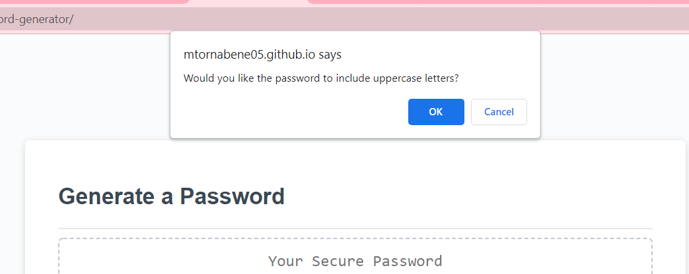
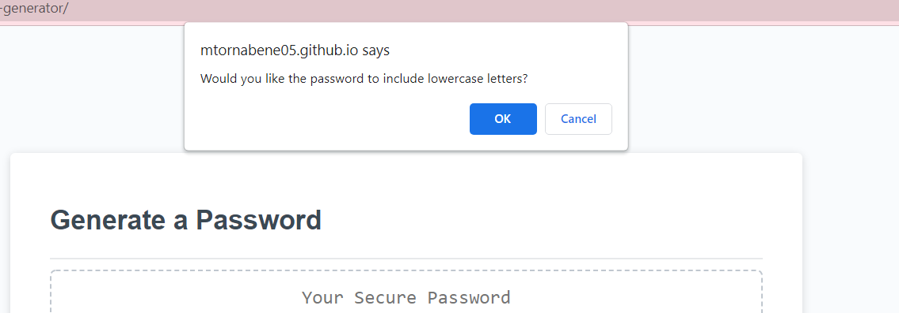
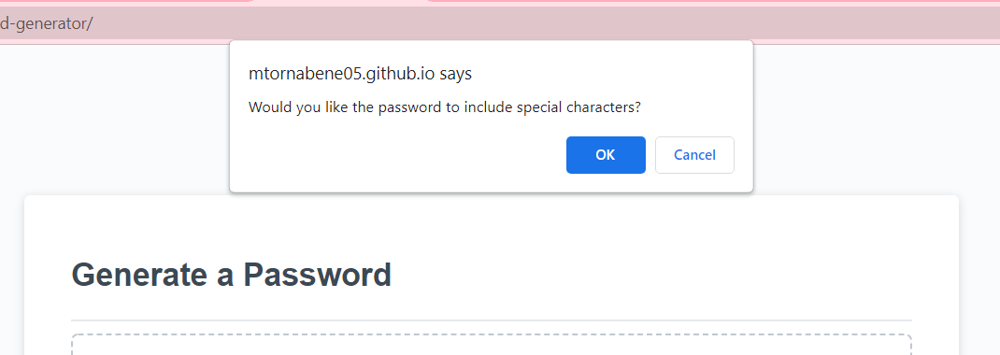

# Random Password Generator

## Description
This application can be used to generate a random password between 8 and 128 characters long while specifying the types of characters used. You can select from options including uppercase letters, lowercase letters, numbers, and special characters

## Built With
* HTML
* Javascript

## Website
Direct Website URL: https://mtornabene05.github.io/password-generator/

Repository URL: https://github.com/mtornabene05/password-generator

## Screenshots
This is a screenshot of screen at initial deployment.

These are screenshots of the prompts.

This is how the resulting random password will appear.

Contribution
Made with ❤️ by Maria Tornabene
